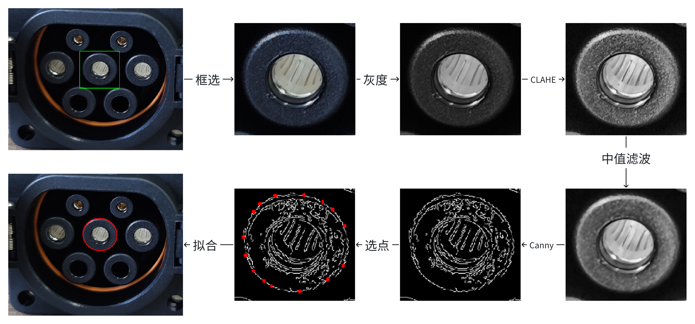

# [汽车充电口圆孔分割标注优化方法](https://txyn3psha8.feishu.cn/wiki/IlAAwWBo8iwqhJkmbvfcHnD5nbd?from=from_copylink)

## 一、概述
​	背景：国标充电口内含7个在同一平面内的规则圆孔，尺寸和分布是确定的。因此，充电机械臂可以依靠单目视觉使用PnP算法求解充电口到相机的相对位姿。PnP有多种求解方法且广泛应用，通常需要大于3对的不共线3D-2D点对以完成求解。在充电口内的圆孔平面建立3D坐标系，可由国标数据直接获得7个圆孔的尺寸以及圆心坐标；在相机图像上，可以通过检测算法识别7个圆孔的像素尺寸和中心。这样，得到7对3D-2D点对，符合PnP问题的求解要求。在该PnP问题中，3D点已知且相对精准，**2D点的检测精度决定了最终的求解精度**。在检测图像圆孔的算法中，相较于传统计算机视觉算法，基于深度学习的语义/实例分割算法具有较高的精度和鲁棒性，适合在终端自动化程序中部署。

​	基于深度学习的语义/实例分割算法依赖高精度的标注数据，传统语义分割标注是使用多边形描绘待分割物体的像素边界。在本案例中，待分割对象是规则的正圆或者椭圆（当相机光轴与圆孔平面不垂直），针对这种情况提出了一种分割标注的优化方法：对每一个待标注圆孔局部图像求解Canny边缘特征点，然后手动选取Canny外轮廓点作为圆孔边界点，使用椭圆拟合算法进行标注。**实测标注效率从5min/frame提升到了2min/frame，精度也较传统分割标注更高。**


## 二、具体流程


流程如图所示，有以下的关键步骤：
1. **框选圆孔**：原图背景比较复杂，用鼠标框选出圆孔区域在局部图像上处理，可以增强算法的适应性，减少图像处理的工作量和难度。后续可以应用同样的自适应图像算法。
2. **图像预处理**：采用了RGB转灰度、自适应直方图均衡化(CLAHE)、中值滤波，三个预处理。 其中，自适应直方图均衡化可以减少亮度不均的影响，提高局部对比度；中值滤波则可以减少图像噪声，平滑图像而不会模糊边缘。
3. **Canny边缘检测**：通过计算灰度图像的梯度来检测图像中的边缘，可以通过调整算法参数，保留尽量多的外层轮廓边缘，供后续的手工点选轮廓。
4. **霍夫圆检测：**利用Canny边缘检测结果做霍夫圆拟合，然后取最大的霍夫圆；找到霍夫圆附近的Canny点，用于第6步椭圆拟合。
5. **点选轮廓**：在Canny边缘检测结果图像上均匀地手工点选圆孔的外轮廓。如果Canny没有检测到足够的高质量边缘点，可以选择从框选的原图出发，手工描绘圆孔的轮廓点。
6. **椭圆拟合**：使用最小二乘法拟合椭圆（正圆是特殊的椭圆）。



## 三、操作方法
标注工具的操作方法如下：
1. 执行python main.py，在弹出的窗口中点击“选择文件夹“，选好后点击”开始标注“。
2. 在打开的图像上，使用**鼠标左键**按住拖动画矩形框，框选出准备标注的圆孔区域。
3. 此时会使用霍夫圆+椭圆拟合算法计算圆孔轮廓，并用黄圈显示在主视图。如果效果符合预期，按**空格键**确认，然后直接开始下一个圆孔的标注；如果没有产生拟合结果或者结果不符合预期，可不按空格键，重复第2步再次尝试，或者直接进入第4步进行手动标注。
4. 在弹出的ROI（Canny）图中，用**鼠标左键**点选圆孔轮廓点，会自动吸附到离鼠标点击最近的Canny边缘点上。一般选10-15个点能得到理想的结果。按**鼠标中键**可回退一个选点。
5. 选完点后按**空格键**结束，此时主图像会用红色椭圆显示刚刚标注的圆孔轮廓。按**ESC键**可回退一个圆孔轮廓。
6. 重复1～3，按照从左到右，从上到下的顺序标完7个圆孔。
7. 如果Canny算法效果不佳，可以按**R键**屏蔽Canny算法，然后重新执行1～3，使用原图手工描绘轮廓。标完一个圆孔后，恢复使用Canny方法。
8. 完成所有圆孔标注后按**Q键**结束当前图像标注，生成mask和polygon的标注结果并保存。


> [!CAUTION]
>
> - 使用去畸变的图像标注，可以保证圆孔在图像上的投影特征（即正圆或者椭圆），适用椭圆拟合。所以在模型训练和推理中，也建议使用去畸变的图像！
>
> - 一定要按照指定的顺序进行标注，顺序为：
>```
>        1        2
>   3        4         5
>   ​     6        7
>```

 

## 四、标注后验证和优化
​	由于充电口圆孔实物的尺寸/位置均符合国家标准，且它们在同一平面。所以可以应用图像的单应性来验证标注的精度，以及更进一步地优化标注结果。

**单应性（Homography）：**
	描述同一三维平面在两个不同视角下的投影变换关系，用于实现点对点的精确映射。单应矩阵（H）的计算只需要4个非共线的平面点对，而不依赖相机的内外参。因此，可以比较容易地使用单应性来验证和优化标注结果。而如果知道相机内参K，也可以利用H来计算外参，即相机位姿。

**具体步骤：**

1. **坐标转换**：将现实圆孔平面看作一个二维图像P，1m的长度对应1个像素；
2. **求解单应矩阵**：利用图像P和相机图像上的圆孔圆心点对，计算单应矩阵H；
3. **反投影验证**：通过H，将图像P的标准圆孔投影回相机图像，对比圆孔位置和尺寸的投影偏差，偏差过大则表明该图像标注精度低；
4. **标注优化（可选）**：根据平面满足单应性的原理，将反投影的圆孔圆心位置和尺寸偏差作为损失函数，用最小二乘法优化图像标注的圆孔参数。

## 五、实验和总结
### 1. 圆形检测的传统CV算法
传统CV有很多可以实现圆形检测的算法，但是这些算法需要比较细致的手调参数才能达到较好的效果，且参数对图像具有特异性，导致这些算法的泛化性、鲁棒性都比较差，无法作为终端设备上自动设别圆孔的方法。

下表是尝试使用过检测圆孔的传统CV算法：

| 序号 | 方法名称                  | 原理简述                                                     | 特点                                                         |
| ---- | ------------------------- | ------------------------------------------------------------ | ------------------------------------------------------------ |
| 1    | Hough Circle 变换         | 利用图像中的边缘点（一般用Canny）来投票确定圆的参数：圆心坐标 (a, b) 和半径 r | 可检测多个圆形，但是对椭圆无效； <br />对遮挡/噪声敏感； <br />参数难调，对不同图像的**泛化性差**。 |
| 2    | 拟合椭圆（fitEllipse）    | 提取轮廓 → 最小二乘法拟合椭圆                                | 快速、适用于椭圆/圆，可获得亚像素精度结果； <br />对噪声敏感，对缺失边缘性能下降； <br />需要轮廓封闭，对图像预处理的要求很高，不同图像可能需要完全相反的预处理，**泛化性差**。 |
| 3    | 模板匹配（TemplateMatch） | 以预定义圆模板滑窗匹配图像区域                               | 实现简单、可控制、对标准图案有效；<br />对角度、尺度变化不敏感、速度慢； <br />对场景、光照等敏感，**泛化性差**。 |

**传统CV算法的核心问题：泛化性差。**
举例说明：
  


在上面的图像中圆孔轮廓和外轮廓有少许粘黏（连通)，需要对二值化图进行腐蚀操作(左图），将圆孔轮廓和外部轮廓分离；而如果执行膨胀操作（右图），会让它们更加粘黏。从而的得不到圆孔轮廓。

而下面的图像中，圆孔中由于材料的漫反射，有亮暗不一的噪点，需要对二值化图进行闭运算（先膨胀再腐蚀，右图），如果只进行腐蚀（左图）或者开运算，无法得到圆孔的连通域。且由于图像尺度的差异，形态学运算的核大小参数也不能共用。

 

> [!CAUTION]
>
> 可见传统CV方法的主要局限：参数需要精调，在不同场景下无法公用，导致泛化性能差。


### 2. 传统算法+人工

​	在图像标注中，可以通过在传统CV方法中添加限制和人工手段，让它们更加精准和高效。

以本方法为例：

​	首先使用人工框选缩小图像处理的范围，减小复杂度；然后在局部图像上使用Canny边缘检测算法，得到足够的高质量边缘点；接着直接使用人工介入点选合适的边缘点，代替Hough Circle方法的投票累加方法；最后使用选择出来的边缘点来使用最小二乘法拟合椭圆，得到最终的准确标注结果。